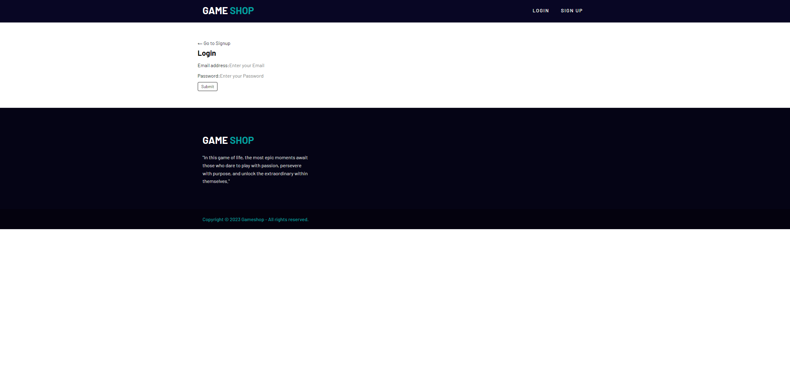
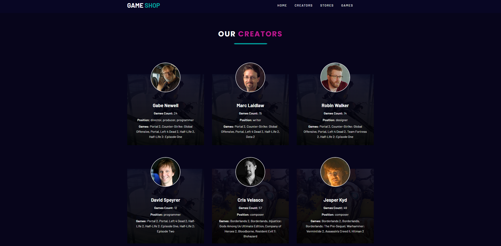
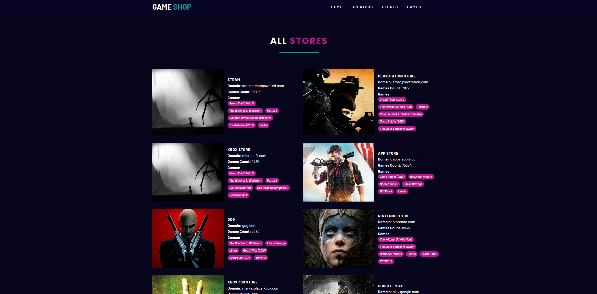

# Gameshop

## Introduction

Gameshop is your one-stop destination for exploring a vast collection of games, discovering talented game creators, and finding the best places to purchase your favorite games. Whether you're a passionate gamer looking for the latest releases or an aspiring game developer eager to showcase your creations, Gameshop has something for everyone.

## Table of Contents
- [Introduction](#introduction)
- [Features](#features)
- [Technologies Used](#technologies-used)
- [Usage](#usage)
- [API Documentation](#api-documentation)
- [Screenshots](#screenshots)
- [Contributing](#contributing)
- [License](#license)
- [Contact](#contact)

## Features

Game Exploration: Browse through a diverse selection of games, spanning various genres and platforms.

Creator Showcase: Discover talented game creators and their unique contributions to the gaming world.

Buy with Confidence: Find reliable information on where to purchase games, ensuring a seamless shopping experience.

## Technologies Used

React
GraphQl
Node.js
Express.js
MongoDB and Mongoose ODM
SASS
JWT
RAWG.io api
Render for deployment

## Usage

Visit our webpage:
https://gameshop-fges.onrender.com/

## API Documentation

https://api.rawg.io/docs/

## Screenshots

## Contributing
None

## License

## Contact
For additional questions, contact.
GitHub: [SacredSoulrend](https://github.com/SacredSoulrend)
GitHub: [Stephen-Garcia](https://github.com/Stephen-Garcia)
GitHub: [Blakewb3](https://github.com/Blakewb3)

